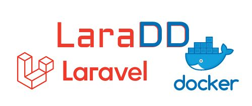

# LaraDD
Laravel Dockerized Development - ready to use laravel developer environment

This "magic" package includes
* laravel v9
* php 8.0
* nginx:stable
* mysql:8
* mongo:latest
* redis:latest
* xdebug & tideways

# Run
    make install
Done! Go to your laravel installation: 
HTTP: http://localhost:8888/
HTTPS: https://localhost:8889/

## Run artisan commands
    make artisan <command>
    
## Stop container
    make down

## Start existing container
    make up
    
## Start Watcher (CSS & JS)
    make watch